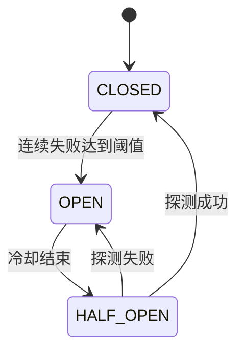

# 模块、领域模型与自动路由设计

状态：设计草案  
更新时间：2026-08-03

## 1. 模块拆分

| 模块 | 核心职责 | 第一阶段输出 |
|---|---|---|
| 站内鉴权 | 管理中转站令牌、权限、限流 | 创建/撤销令牌、哈希存储、调用鉴权 |
| 供应商管理 | 保存供应商、Base URL、协议类型 | DeepSeek、SiliconFlow 适配器 |
| 上游 API 管理 | 加密保存 API Key、别名、额度备注、启停 | CRUD、掩码展示、连接测试 |
| 模型目录 | 维护供应商模型与统一模型别名 | 模型列表、能力、上下文、状态 |
| 价格中心 | 标准化输入/输出价格和币种 | 每百万 Token、来源、核对时间、快照 |
| 活动中心 | 保存折扣、赠送额度和有效期 | 来源、开始/结束时间、过期过滤 |
| API 分组 | 把多个上游 API 组成有序候选列表 | 分组 CRUD、拖拽排序、启停成员 |
| 路由引擎 | 选择上游并执行故障转移 | 顺序优先、错误分类、最大尝试次数 |
| 健康与熔断 | 记录连续失败、冷却和恢复 | CLOSED/OPEN/HALF_OPEN 状态机 |
| 协议适配器 | 统一请求、响应、错误与用量 | OpenAI Chat Completions 转发 |
| 用量与审计 | 记录 Token、耗时、成本和尝试链 | 请求记录、路由尝试、每日统计 |
| Web 管理端 | 管理配置、分组、价格和运行状态 | Dashboard、供应商、分组、日志页面 |
| Android 客户端 | 移动查看、配置和告警 | 接入后端，不再保存正式上游主密钥 |

## 2. 领域模型

### Provider（供应商）

- `id`、`name`
- `protocolType`：`OPENAI_COMPATIBLE`、`ANTHROPIC`、`GEMINI` 等
- `officialUrl`、`pricingUrl`
- `enabled`、`createdAt`、`updatedAt`

### UpstreamEndpoint（上游 API）

一条记录代表一个实际可调用的供应商账号或中转渠道。

- `id`、`ownerId`、`providerId`
- `displayName`、`baseUrl`
- `encryptedApiKey`、`apiKeyLastFour`
- `enabled`、`timeoutMs`
- `dailyBudget`、`monthlyBudget`（可选）
- `createdAt`、`updatedAt`

约束：API Key 永远不出现在普通查询 DTO、日志或错误消息中。

### ModelCatalogEntry（模型目录）

- `id`、`providerId`、`upstreamModelId`
- `displayName`
- `canonicalModelAlias`：例如站内别名 `deepseek-chat-default`
- `contextWindow`
- `capabilities`：文本、视觉、工具调用、JSON、流式等
- `enabled`、`sourceUrl`、`verifiedAt`

### PriceSnapshot（价格快照）

- `id`、`providerId`、`modelCatalogEntryId`
- `currency`
- `inputPricePerMillionTokens`
- `cachedInputPricePerMillionTokens`（可选）
- `outputPricePerMillionTokens`
- `billingScope`：地区、实时/批量、上下文阶梯等
- `sourceUrl`、`effectiveFrom`、`verifiedAt`

价格不可直接覆盖旧记录；应新增快照并把旧记录标记为非当前，才能展示历史变化。

### Promotion（活动）

- `id`、`providerId`、`title`
- `type`：折扣、赠送额度、价格调整
- `description`、`sourceUrl`
- `startsAt`、`endsAt`
- `status`：草稿、已验证、已过期
- `verifiedAt`

没有来源或有效期不明确的内容不得标记为“已验证活动”。

### ApiGroup 与 ApiGroupMember

`ApiGroup`：

- `id`、`ownerId`、`name`
- `publicModelAlias`
- `routingPolicy`：第一阶段固定 `ORDERED_FAILOVER`
- `maxAttempts`、`enabled`、`version`

`ApiGroupMember`：

- `id`、`groupId`
- `upstreamEndpointId`、`modelCatalogEntryId`
- `priorityRank`：数值越小越优先
- `enabled`
- `requestOverrides`：温度、最大 Token 等白名单覆盖项（可选）

同一分组内 `priorityRank` 必须唯一。拖拽排序应在单个事务中更新，并通过 `version`
做乐观锁，避免两个页面同时保存造成顺序覆盖。

### HealthState（健康与熔断）

- `groupMemberId`
- `circuitState`：`CLOSED`、`OPEN`、`HALF_OPEN`
- `consecutiveFailures`
- `lastSuccessAt`、`lastFailureAt`
- `cooldownUntil`、`lastFailureCategory`
- `latencyEwmaMs`

### GatewayRequest、RouteAttempt 与 UsageRecord

`GatewayRequest` 保存请求 ID、用户、模型别名、开始/结束时间与最终状态。

每尝试一个上游新增一条 `RouteAttempt`：

- `gatewayRequestId`、`groupMemberId`、`attemptIndex`
- `startedAt`、`endedAt`
- `resultCategory`、`upstreamStatusCode`
- `firstTokenAt`、`retryable`、`billingUncertain`
- `sanitizedError`

`UsageRecord` 保存最终 Token、供应商 usage、估算成本与币种。一次网关请求可能有多次
尝试，所以必须区分最终成功用量与可能已经发生费用的失败尝试。

## 3. 有序故障转移

### 候选生成

1. 解析站内模型别名并找到 API 分组。
2. 读取带版本号的分组快照，保证单次请求中的顺序不变。
3. 过滤被禁用的分组、成员、上游和模型。
4. 过滤当前处于 `OPEN` 且尚未到冷却时间的成员。
5. 过滤不支持请求能力的模型。
6. 按 `priorityRank ASC` 排序。
7. 截断到 `maxAttempts`，避免无边界重试。

### 第一阶段错误分类

| 情况 | 是否切换 | 处理方式 |
|---|---:|---|
| DNS、连接失败、连接超时 | 是 | 记录网络故障并增加失败计数 |
| 首 Token 前读取超时 | 是 | 取消当前调用并尝试下一成员 |
| HTTP 408、429 | 是 | 读取 `Retry-After`，进入短暂冷却 |
| HTTP 500、502、503、504 | 是 | 作为供应商临时故障 |
| 上游 401 | 是，快速熔断 | 视为密钥失效，长冷却并告警 |
| 上游 403、余额不足、模型无权限 | 是 | 标记配置/额度问题并告警 |
| HTTP 400、422 参数错误 | 否 | 请求本身有误，直接返回客户端 |
| 内容安全拒绝 | 默认否 | 防止通过切换绕过安全策略 |
| 客户端主动取消 | 否 | 立即取消全部上游请求 |
| 已输出首个流式 Token 后失败 | 否 | 结束当前流，不静默重放 |

错误必须由适配器转换为统一枚举，路由引擎不解析供应商原始错误字符串。

### 路由伪代码

```text
candidates = buildOrderedCandidates(groupSnapshot, request)

for member in candidates.take(group.maxAttempts):
    attempt = beginAttempt(requestId, member)
    try:
        response = adapter.call(member, request)
        if response.startedStreaming:
            pinRequestTo(member)
        markSuccess(member, attempt, response.usage)
        return response
    catch error:
        category = adapter.classify(error)
        markFailure(member, attempt, category)
        if responseStarted or not category.failoverAllowed:
            throw gatewayError(category)

throw allUpstreamsUnavailable(attemptSummaries)
```

### 流式请求边界

只有在尚未向客户端发送响应头或首 Token 时才能安全切换。一旦开始输出：

- 不再尝试其他上游；
- 记录 `PARTIAL_STREAM_FAILURE`；
- 关闭流并返回可识别错误（若协议允许）；
- 由客户端决定是否发起新请求。

否则可能产生两次费用、重复回答，或把两个模型的内容拼接到一个响应中。

### 重复扣费风险

读取超时不等于供应商没有完成推理。切换前应在 `RouteAttempt` 标记
`billingUncertain=true`。供应商支持幂等键时传递站内请求 ID；不支持时管理端要展示
“可能重复计费”，不能只统计最终成功调用。

## 4. 熔断状态机



初始建议值（必须配置化）：

- 连续 3 次可归因于上游的失败后打开熔断；
- 429 优先遵循 `Retry-After`，否则默认冷却 60 秒；
- 401/余额不足默认冷却 30 分钟并产生高优先级告警；
- HALF_OPEN 同时只允许一个探测请求；
- 400、422 与客户端取消不计入熔断失败。

## 5. 接口草案

### 对外中转

- `POST /v1/chat/completions`
- `GET /v1/models`
- 后续：`POST /v1/responses`

### 管理接口

- `POST /api/admin/session`
- `GET/POST /api/admin/providers`
- `GET/POST/PATCH/DELETE /api/admin/upstreams`
- `POST /api/admin/upstreams/{id}/test`
- `GET/POST /api/admin/models`
- `GET /api/admin/prices`
- `GET /api/admin/promotions`
- `GET/POST/PATCH/DELETE /api/admin/groups`
- `PUT /api/admin/groups/{id}/members/order`
- `POST /api/admin/groups/{id}/dry-run`
- `GET /api/admin/requests`
- `GET /api/admin/requests/{id}/attempts`
- `GET /api/admin/usage/summary`

`dry-run` 只返回候选顺序与过滤原因，不真正请求供应商。

## 6. 安全要求

- API Key 使用独立主密钥进行 AES-GCM 加密，主密钥只来自环境变量或 Secret Manager。
- 数据库、备份、接口响应和错误日志不得出现明文密钥。
- Base URL 必须执行 HTTPS、域名白名单和私网地址检查，防止 SSRF。
- 日志统一脱敏 Authorization、Cookie、密钥字段和供应商原始错误。
- 站内令牌只保存强哈希；创建时仅显示一次明文。
- 管理接口和中转接口使用不同鉴权与限流策略。
- 配置导出默认不含密钥；所有配置变更写审计日志。

## 7. 价格与活动采集

来源优先级：官方结构化 API → 官方页面人工核对 → 合规定时采集 → 社区线索待核实。

采集任务只生成候选快照，价格变化经校验后发布。所有价格标准化为每百万 Token，
同时保留原币种、地区、阶梯、缓存价和批量价，不能用单一数字覆盖复杂计费规则。

## 8. Web 页面

| 页面 | 主要内容 |
|---|---|
| 总览 | 成功率、请求量、成本、熔断和告警 |
| 供应商/API | Base URL、密钥掩码、测试、启停、健康状态 |
| 模型与价格 | 模型能力、当前价格、来源、历史曲线 |
| 折扣与活动 | 类型、有效期、来源、过期状态 |
| API 分组 | 创建分组、拖拽排序、映射、最大尝试次数 |
| 路由记录 | 候选、尝试顺序、错误和最终上游 |
| 用量与成本 | Token、供应商、模型、日/月成本 |
| 系统设置 | 站内令牌、采集频率、告警和备份 |

