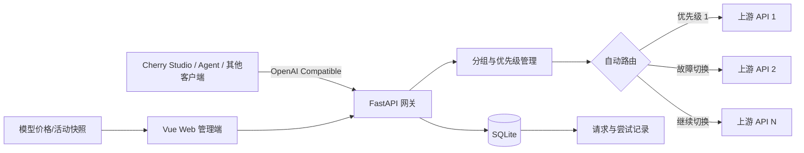

# Personal Gateway Plus 项目介绍

> 项目类型：个人 AI API 中转站与智能路由网关  
> 汇报人：唐鑫阳  
> 当前阶段：本地可运行初版（MVP）  
> 文档更新时间：2026-08-18  
> 当前范围：Web 管理端 + FastAPI 服务端；Android 工程仅保留为历史代码

## 1. 项目概述

**Personal Gateway Plus（个人 AI API 中转站 Plus）** 是一个面向个人开发者和 AI Agent 的多上游模型 API 管理与自动路由系统。

项目把多个模型供应商或中转平台的 API 统一组织到“分组”中，并通过一个 OpenAI 兼容接口对外提供服务。调用方只需要填写一个网关地址和一个分组标识，无须了解组内每个真实 API 的地址与密钥。网关会按照用户设置的优先级依次调用上游；当前置 API 因网络、超时、限流或服务端错误不可用时，自动切换到后备 API。

除核心网关能力外，项目还提供 Web 管理端、请求追踪、模型价格与活动信息展示，以及本地一键启动脚本，形成一个可配置、可观察、可演示的完整 MVP。

## 2. 选题背景

个人开发者在使用多个大模型平台时，通常会遇到以下问题：

- API 地址、密钥和模型名称分散，切换与维护成本高；
- 某个上游出现超时、限流或故障时，依赖它的 Agent 会直接中断；
- 不同平台的模型价格和活动信息分散，缺少统一查看入口；
- 调用失败后难以确认请求最终走了哪个上游、为什么发生切换；
- 不同客户端的配置方式不统一，重复录入真实 API Key 存在泄露风险。

因此，本项目希望在客户端和多个模型供应商之间增加一个本地网关层，把“管理、路由、兼容和追踪”集中处理。

## 3. 项目目标

1. 统一管理多个上游 API 与模型配置；
2. 支持按优先级组成 API 分组；
3. 实现故障识别与自动切换；
4. 对外提供 OpenAI Chat Completions 兼容接口；
5. 提供可视化管理和请求追踪能力；
6. 汇总模型价格、来源和活动信息；
7. 让项目在本地环境中可以一键启动和演示。

## 4. 核心功能

### 4.1 上游 API 管理

- 新增、编辑、启用或停用上游；
- 配置上游名称、Base URL、API Key、模型名称和超时时间；
- API Key 加密保存，管理接口仅返回掩码，不向前端回传明文；
- 兼容只填写域名、填写到 `/v1`、或填写完整 Chat Completions 路径的常见配置方式。

### 4.2 API 分组与优先级

- 将多个上游加入同一分组；
- 每个分组拥有唯一 `routeKey`；
- 用户可调整组内顺序；
- 调用时将 `routeKey` 放入请求的 `model` 字段，网关再映射到具体上游模型。

### 4.3 自动路由与故障切换

网关按照分组中的优先级顺序尝试上游：

- 连接失败、超时、HTTP 408、HTTP 429、HTTP 5xx：判定为可重试故障，继续尝试后备上游；
- 其他 HTTP 4xx：通常表示请求参数或权限问题，不自动切换，直接返回错误；
- 任一上游调用成功后立即结束路由，并在响应头中返回最终上游和请求编号。

### 4.4 OpenAI 兼容接口

当前对外核心接口：

```text
POST http://127.0.0.1:8000/v1/chat/completions
```

客户端配置示例：

| 配置项 | 示例值 |
|---|---|
| API 类型 | OpenAI Compatible |
| Base URL | `http://127.0.0.1:8000/v1` |
| API Key | 任意非空本地标识，例如 `local-gateway` |
| Model | 分组的 `routeKey`，例如 `my-test-route` |
| 流式输出 | 当前应关闭 |

请求示例：

```bash
curl http://127.0.0.1:8000/v1/chat/completions \
  -H "Content-Type: application/json" \
  -H "Authorization: Bearer local-gateway" \
  -d '{
    "model": "my-test-route",
    "stream": false,
    "messages": [
      {"role": "user", "content": "请用一句话介绍你自己。"}
    ]
  }'
```

### 4.5 请求记录与可观测性

- 记录每次网关请求；
- 记录每个上游尝试的顺序、耗时、HTTP 状态和失败原因；
- 通过 `X-Upstream` 查看最终使用的上游；
- 通过 `X-Request-Id` 查询完整路由链路；
- Web 端以时间线形式展示是否发生了自动切换。

### 4.6 模型价格与活动信息

- 模型目录支持新增、编辑、启停、检索和删除；
- 新价格以快照形式发布，旧价格自动归档并可查看完整历史；
- 同一模型只保留一个当前价格，删除当前快照时自动恢复最近历史版本；
- 标注币种、输入/输出单价、官方来源、生效时间和核验时间；
- 对缺失价格和超过 30 天未核验的数据给出明确提示；
- 活动支持待核验草稿、已核验发布和手动结束；
- 页面自动区分待核验、未开始、进行中和已过期四种状态；
- 已核验活动必须填写有效来源、起止时间和核验时间。

**当前数据性质说明：价格和活动信息是数据库内可追溯的人工核验快照，并非运行时实时抓取。** Web 刷新只读取数据库；如果供应商更新价格，仍需人工核对并发布新快照。实时采集、定时刷新和变更通知属于独立的后续采集模块。

### 4.7 Web 管理与本地一键启动

- Web 端提供上游管理、分组排序、调用测试、请求记录、价格与活动页面；
- 根目录 `start-all.bat` 可统一启动后端、Web 和可选 Mock 服务；
- `-NoMock` 用于真实 API 测试，`-Restart` 用于处理旧进程占用端口的情况。

## 5. 系统架构



主要组成：

- **服务端**：FastAPI、SQLAlchemy、HTTPX、SQLite；
- **Web 端**：Vue 3、TypeScript、Vite、Element Plus；
- **测试与演示**：Mock 上游、自动化单元测试、Web 调用测试页；
- **启动工具**：Windows 一键启动脚本。

`app/` 中的 Android 工程作为早期方案保留，但自 2026-08-18 起不再属于当前开发和验收范围。

## 6. 核心路由流程

1. 客户端把分组 `routeKey` 作为 `model` 发送到网关；
2. 网关查询分组及其启用的上游成员；
3. 按用户配置的优先级从前到后尝试；
4. 网关将请求中的分组名替换为该上游的真实模型名；
5. 如果遇到可重试故障，记录失败并切换到下一上游；
6. 成功后返回 OpenAI 兼容响应，并附带 `X-Upstream`、`X-Request-Id`；
7. 如果所有上游都失败，则返回统一的网关错误和完整尝试记录。

## 7. 已完成模块

| 模块 | 当前状态 | 说明 |
|---|---|---|
| 上游 API 管理 | 已完成 | 增删改查、启停、密钥掩码与加密存储 |
| 分组管理 | 已完成 | 创建分组、添加成员、优先级排序 |
| 自动路由 | 已完成 | 按优先级调用并在可重试故障时切换 |
| OpenAI 兼容调用 | 已完成（MVP） | 支持非流式 `/v1/chat/completions` |
| 请求追踪 | 已完成 | 请求详情与尝试时间线 |
| Web 管理端 | 已完成（MVP） | 管理、测试、日志、价格、活动页面 |
| 模型与价格管理 | 已完成（人工核验闭环） | 模型 CRUD、唯一当前价、价格历史、来源与新鲜度提示 |
| 活动信息管理 | 已完成（人工核验闭环） | 草稿/发布/结束与四种生命周期状态 |
| 一键启动 | 已完成 | 统一启动本地所需服务 |
| 第三方客户端验证 | 已完成 | 已在 Cherry Studio 中完成真实对话测试 |

## 8. 测试与验证

2026-08-18 在当前工作区重新执行验证：

- 服务端 `unittest`：**19 项全部通过**；
- Web 端 TypeScript 检查与 Vite 构建：**通过**；
- Web 真实页面已验证价格发布与历史归档、活动草稿与状态统计，浏览器控制台无错误；
- 已覆盖 500 错误切换、400 错误不切换、URL 兼容、请求编号、消息内容兼容、请求记录查询、分组排序和密钥加密等场景；
- 已通过 Web 调用测试页验证真实 API 正常调用与自动切换；
- 已通过 Cherry Studio 使用 `my-test-route` 完成外部客户端对话。

构建过程中仍有一个非阻塞提示：Web 主包体积较大，后续可以通过按需引入与代码分包优化。

## 9. 当前边界与不足

- 当前定位为本地单用户 MVP，尚未实现调用方鉴权和配额控制；
- Chat Completions 仅支持 `stream=false`，尚未提供 SSE 流式透传；
- 尚未提供完整的 `/v1/models`、Responses API、工具调用等兼容能力；
- 价格历史已经可追溯，但价格与活动尚未自动抓取，也没有定时更新和变更提醒；
- 暂未完成服务器部署、HTTPS、访问控制、备份与生产级监控；
- 当前路由以顺序故障转移为主，尚未加入健康检查、熔断、负载均衡和成本优选策略。

## 10. 后续开发计划

### P0：完善可用性

- 增加网关调用密钥与访问控制；
- 支持 SSE 流式输出；
- 增加 `/v1/models`，提升第三方客户端兼容性；
- 完善错误映射、超时配置和异常提示。

### P1：增强路由与数据能力

- 定时健康检查、短期熔断与自动恢复；
- 支持轮询、权重、延迟优先和成本优先等路由策略；
- 为不同供应商建立可审计的价格/活动采集适配器和候选审核流程；
- 增加价格变化与活动到期提醒。

### P2：走向长期使用

- 支持 Responses API、工具调用和更多消息格式；
- 增加用户、权限、配额和用量统计；
- 增加 Docker、HTTPS、数据库迁移、备份和监控；
- 增加价格趋势、币种换算、采集任务监控与通知渠道。

## 11. 建议汇报演示流程（3—5 分钟）

1. 用一句话说明项目解决的问题；
2. 在 Web 端展示两个真实上游及其 API 分组；
3. 展示组内顺序和 `routeKey`；
4. 发送一次正常请求，说明最终上游与请求编号；
5. 让第一上游失败，再次请求，展示自动切换到第二上游；
6. 打开请求时间线解释失败原因、耗时和切换结果；
7. 在 Cherry Studio 中调用分组接口，证明可供外部 Agent 使用；
8. 展示价格历史与活动生命周期，并明确说明当前是人工核验快照、自动采集属于下一阶段。

## 12. 项目价值总结

Personal Gateway Plus 不只是一个 API 转发器，而是把多上游管理、故障切换、统一接口、请求追踪和价格信息汇总组合成一个完整的个人 AI 基础设施。当前初版已经打通“配置上游—建立分组—对外调用—自动切换—追踪结果”的核心闭环，具备实际使用与课堂演示价值，也为后续实时价格采集、智能路由和生产部署留下了清晰的扩展方向。
