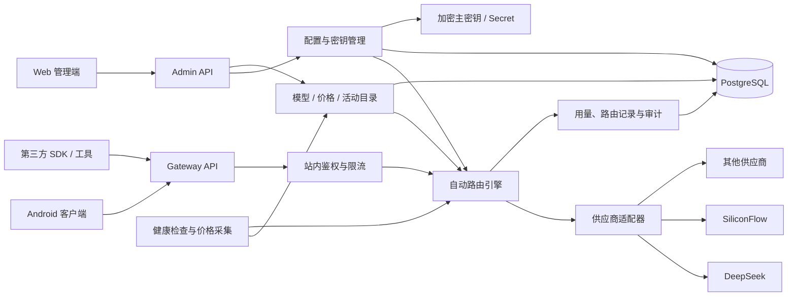

# Personal Gateway Plus：产品与总体架构

状态：设计草案  
更新时间：2026-08-03

## 1. 选题名称

**个人大模型 API 中转站 Plus——模型价格聚合、密钥分组与故障自动路由平台**

项目内部简称：**Personal Gateway Plus**。

## 2. 产品概述

Personal Gateway Plus 是面向个人开发者和小型团队的自托管大模型 API 中转与管理
平台。它在提供统一 OpenAI 兼容调用入口的基础上，聚合主流平台和供应商的模型、
价格、折扣与活动信息，并集中管理用户持有的多个上游 API。

用户可以把多个上游 API 加入同一分组，通过拖拽或序号设置优先级。高优先级 API
因超时、限流、余额不足、模型无权限或服务故障无法调用时，路由引擎依据明确的错误
分类、健康状态和熔断规则尝试下一个 API。平台同时记录每次尝试、Token 用量、延迟、
估算成本和最终上游，以便排障和控制费用。

## 3. 建设目标

### 核心目标

1. 提供稳定的 OpenAI 兼容入口，例如 `POST /v1/chat/completions`。
2. 安全管理供应商、Base URL、API Key、模型映射与启停状态。
3. 支持 API 分组、人工排序、健康检测、熔断和顺序故障转移。
4. 聚合模型目录、标准价格、价格快照、折扣和活动有效期。
5. 记录路由过程、用量、延迟、错误与估算成本。
6. 让 Web 管理端和 Android 客户端共用同一后端和接口契约。

### 第一阶段非目标

- 不做面向公众的额度销售、充值、开票与复杂计费结算。
- 不做复杂多租户 RBAC；先完成单用户自托管，同时预留 `ownerId`。
- 不承诺在已经输出流式 Token 后无缝切换上游。
- 不通过抓取绕过登录、验证码、访问控制或供应商服务条款。
- 不在浏览器或 Android 安装包里保存供应商主密钥。

## 4. 主要场景

- **统一入口**：客户端只配置一个中转地址与站内令牌，不感知各供应商密钥。
- **顺序路由**：正常使用 API-A；A 出现可切换故障后尝试 B，再尝试 C。
- **模型比价**：查看上下文、输入/输出价格、币种、来源、核对时间与历史快照。
- **活动管理**：展示有来源和有效期的折扣/赠送额度，并结合用量估算成本。
- **问题追踪**：查看一次请求为何跳过某个 API、尝试顺序和最终使用的上游。

## 5. 总体架构



## 6. 架构原则

### 控制面与数据面分离

- **控制面**管理供应商、密钥、模型、价格、分组、排序、策略和统计。
- **数据面**处理 `/v1/*` 请求、选择上游、转发、流式输出与用量记录。
- 两者早期可部署在同一服务，但代码模块必须分开，方便以后独立扩容。

### 后端是唯一事实来源

- 上游 API Key 只存在后端加密存储；客户端只能看到 `sk-****abcd`。
- 模型、价格、活动、分组顺序、健康状态和路由记录以后端为准。
- Android 当前的内置参考数据只用于离线演示，不参与正式路由。

### 契约优先

- 新增 `contracts/openapi.yaml`，先确定接口再并行开发各端。
- 对外中转尽量兼容 OpenAI；管理接口使用 `/api/admin/*`。
- DTO 破坏性变更通过新版本或迁移期完成。

### 可解释路由

每次请求都必须能说明候选 API、跳过原因、尝试顺序、失败原因、最终上游，以及是否
存在重复计费风险。

## 7. 建议仓库结构

当前保留 Android `app/`，逐步增加目录，不立即做大规模搬迁：

```text
TS/
├── app/                         # 现有 Android 客户端
├── server/                      # Kotlin/Ktor 后端（计划）
│   ├── gateway/                 # OpenAI 兼容数据面
│   ├── admin/                   # 管理接口与鉴权
│   ├── routing/                 # 路由、重试、熔断
│   ├── catalog/                 # 模型、价格、活动
│   ├── adapters/                # 供应商协议适配器
│   └── persistence/             # 数据库与加密存储
├── web/                         # React + TypeScript 管理端（计划）
├── contracts/
│   └── openapi.yaml             # API 单一事实来源（计划）
├── infra/
│   ├── docker-compose.yml       # 本地联调（计划）
│   └── migrations/              # 数据库迁移（计划）
└── docs/
```

后端建议延续现有 Kotlin 技术栈并使用 Ktor，Web 建议 React + TypeScript。实现语言可
调整，但接口契约、路由规则与数据模型不应由各端各自定义。

## 8. 最小部署边界

- 一个后端服务实例；
- PostgreSQL（本地原型可暂用 SQLite，正式迁移目标为 PostgreSQL）；
- Web 静态资源；
- HTTPS 反向代理；
- 通过环境变量或 Secret Manager 注入的加密主密钥。

价格采集、健康检查和清理任务早期可作为后端定时任务，规模扩大后再拆 Worker。

## 9. 成功标准

- 用一个站内令牌调用至少两个不同上游的同类模型。
- 人工调整分组顺序后，新请求按新顺序路由。
- 第一上游出现可切换故障时自动转到第二上游并留下完整记录。
- 400 类参数错误不会盲目切换并造成多次无效调用。
- 流式响应在首 Token 前可切换；首 Token 后不会静默重放。
- 管理页面、日志和数据库中不存在完整上游 API Key 明文。
- 每条价格和活动都能追溯来源、核对时间与有效期。

