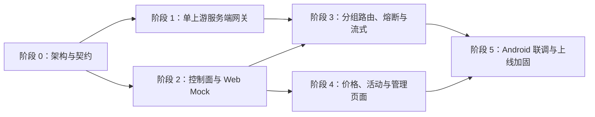

# Personal Gateway Plus：五人协作任务拆分

> 历史分工文档：其中 Android 任务自 2026-08-18 起作废，当前开发和验收只覆盖 Web 与服务端。

> 状态：待认领  
> 最后更新：2026-08-04  
> 适用范围：当前 Android 基础版本之后尚未完成的 Personal Gateway Plus 功能

## 1. 拆分说明

当前已经具备 Android 模型价格展示、活动通知、单供应商直连、API Key 本地加密和基础测试。本计划不重复这些工作，五人重点完成服务端中转、API 分组与自动路由、价格活动数据、Web 管理端、Android 联调和交付保障。

难度采用五级标记：

- ★：明确的小改动，适合刚加入项目的成员。
- ★★：需要熟悉单个模块，适合初级开发者。
- ★★★：涉及数据库、接口或页面状态，适合中级开发者。
- ★★★★：涉及并发、协议、安全或跨模块设计，适合中高级开发者。
- ★★★★★：影响全局架构或资金/密钥安全，需要高级开发者负责并接受交叉评审。

工作量是相对估算，以完整工作日计算，包含编码、自测和文档，不作为硬性工期承诺。

## 2. 五人角色建议

| 人员代号 | 建议水平 | 主工作线 | 主要责任 | 预计总工作量 |
|---|---|---|---|---:|
| A | 高级 | 架构、安全与交付负责人 | 技术决策、契约、认证、安全、部署、代码评审 | 24～32 人日 |
| B | 中高级 | 网关与自动路由负责人 | 代理、流式传输、故障切换、熔断、路由记录 | 30～40 人日 |
| C | 中级 | 控制面与数据负责人 | 供应商、模型、价格、活动、API 分组、用量统计 | 30～40 人日 |
| D | 中级或前端较强 | Web 管理端负责人 | 控制台、配置页面、排序、价格活动、可观测页面 | 28～38 人日 |
| E | 初级到中级 | Android、测试与演示负责人 | Android 接入、测试夹具、回归测试、演示和使用文档 | 24～34 人日 |

如果实际人员水平与建议不一致，应按任务难度重新认领，不必强制按照人员代号分配。★★★★及以上任务不能由经验较少的成员单独合并，至少需要 A 或 B 复核。

## 3. 开发顺序与依赖

阶段 0 的接口契约和数据模型通过评审后，B、C、D、E 才开始依赖这些接口的正式实现。D 可以基于 OpenAPI Mock 提前开发页面，E 可以提前准备测试用例和模拟上游。

## 4. A：架构、安全与交付工作包

### A-01 后端技术选型与工程骨架

- 难度：★★★★
- 工作量：2～3 人日
- 依赖：无
- 内容：确定后端语言和框架、数据库、迁移工具、测试框架；创建 `server/`、`contracts/`、`infra/`；编写 ADR。
- 验收：后端可以启动并返回健康检查，开发环境可以一条命令运行，技术选择有书面理由。

### A-02 OpenAPI 契约与统一错误模型

- 难度：★★★★
- 工作量：3～4 人日
- 依赖：A-01
- 内容：定义登录、供应商、上游、模型、价格、活动、分组、网关、路由记录和用量接口；统一分页、时间、金额、错误码和请求 ID。
- 验收：`contracts/openapi.yaml` 校验通过；能生成 Web/Android 类型；B、C、D、E 联合评审通过。

### A-03 身份认证、用户隔离与权限边界

- 难度：★★★★★
- 工作量：4～6 人日
- 依赖：A-01、A-02
- 内容：第一版实现单用户自托管登录，同时在数据模型保留 `user_id`；管理 API 与网关 API 使用不同权限；补充越权测试。
- 验收：未登录不能读取配置；用户数据查询强制带所有权条件；管理凭证不能通过日志泄漏。

### A-04 服务端密钥保护与 SSRF 防护

- 难度：★★★★★
- 工作量：4～6 人日
- 依赖：A-01、C-02
- 内容：主密钥从环境变量或密钥服务读取；API Key 使用认证加密；返回时脱敏；限制上游 URL 协议、内网地址、重定向和 DNS 重绑定风险。
- 验收：数据库无明文密钥；日志无 Authorization；恶意内网 URL 和不安全重定向被拒绝；具备密钥轮换说明。

### A-05 CI、容器、配置与备份恢复

- 难度：★★★
- 工作量：4～5 人日
- 依赖：A-01，后续持续完善
- 内容：建立格式化、静态检查、单元测试、契约校验和构建流水线；提供 Docker Compose、示例环境变量、数据库迁移、备份恢复脚本。
- 验收：干净环境可按文档启动；CI 自动执行核心检查；完成一次真实备份恢复演练。

### A-06 全局评审、发布清单和故障演练

- 难度：★★★★
- 工作量：7～8 人日，分散在各阶段
- 依赖：全阶段
- 内容：评审高风险 PR；维护架构决策；组织密钥泄漏、上游超时、数据库恢复和版本回滚演练。
- 验收：所有★★★★以上任务有第二评审人；发布清单、回滚步骤和演练记录完整。

## 5. B：网关与自动路由工作包

### B-01 OpenAI 兼容单上游代理

- 难度：★★★★
- 工作量：4～5 人日
- 依赖：A-01、A-02、C-02
- 内容：实现服务端 Chat Completions 非流式代理、请求 ID、超时、连接池、请求体限制和标准错误响应。
- 验收：可通过服务端调用真实上游；客户端不再接触上游密钥；异常都带请求 ID。

### B-02 上游适配器接口与模型映射

- 难度：★★★★
- 工作量：3～4 人日
- 依赖：B-01、C-03
- 内容：抽象统一适配器；先支持 2～3 个 OpenAI 兼容供应商；处理模型名、认证头和兼容字段差异。
- 验收：新增兼容供应商不需要修改路由核心；适配器具备契约测试。

### B-03 候选生成与顺序故障切换

- 难度：★★★★★
- 工作量：5～7 人日
- 依赖：B-01、C-06
- 内容：按用户排序、启停状态、模型支持和健康状态生成候选；实现最大尝试次数与总超时；保存每次尝试原因。
- 验收：第一上游正常时不访问后续节点；可重试故障按顺序切换；无无限重试。

### B-04 错误分类与重试安全

- 难度：★★★★★
- 工作量：4～5 人日
- 依赖：B-03
- 内容：区分 DNS、连接超时、408、429、5xx、401/403、400/422、安全拒绝和客户端取消；控制可能重复扣费的重试边界。
- 验收：每类错误均有自动化测试；参数错误不切换；可能已被上游处理的请求不会无条件重试。

### B-05 流式代理与断流边界

- 难度：★★★★★
- 工作量：5～7 人日
- 依赖：B-03、B-04
- 内容：实现 SSE 流式转发、首字节超时、客户端取消传播；首个有效内容输出前允许切换，输出后不再拼接另一上游回答。
- 验收：慢上游、首包失败、中途断流和用户取消均有测试；不会把两个供应商的响应拼成一个答案。

### B-06 健康状态、熔断和并发保护

- 难度：★★★★★
- 工作量：5～7 人日
- 依赖：B-03
- 内容：实现 Closed/Open/Half-open 状态机、失败阈值、冷却和恢复探测；增加并发上限和上游级限流。
- 验收：熔断时跳过故障节点；冷却后可自动试探恢复；压力测试不存在请求无限堆积。

### B-07 路由审计与性能基线

- 难度：★★★
- 工作量：4～5 人日
- 依赖：B-03～B-06、C-07
- 内容：补齐 RouteAttempt 写入、结构化日志、耗时指标和负载测试；提供典型故障日志样例。
- 验收：可从请求 ID 查到完整路由链；记录不含敏感正文；形成并发和延迟基线报告。

## 6. C：控制面与数据工作包

### C-01 数据库领域模型与迁移

- 难度：★★★★
- 工作量：3～4 人日
- 依赖：A-01、A-02
- 内容：建立 Provider、UpstreamEndpoint、ModelCatalogEntry、PriceSnapshot、Promotion、ApiGroup、ApiGroupMember、HealthState、GatewayRequest、RouteAttempt、UsageRecord 表和索引。
- 验收：迁移可以从空库执行并回滚；金额不使用浮点存储；关键唯一约束和所有权字段完整。

### C-02 供应商与上游端点管理

- 难度：★★★
- 工作量：4～5 人日
- 依赖：C-01、A-03
- 内容：实现供应商和多个上游端点 CRUD、启停、脱敏返回、配置校验和连通性测试。
- 验收：一个供应商可配置多个端点；编辑时无需重新返回完整密钥；连通性测试结果可诊断。

### C-03 模型目录与供应商模型映射

- 难度：★★★
- 工作量：4～5 人日
- 依赖：C-01
- 内容：建立规范模型与供应商模型映射，维护上下文长度、能力标签和可用状态。
- 验收：同一规范模型可映射多个供应商模型名；停用映射不会进入路由候选。

### C-04 价格快照与比较接口

- 难度：★★★★
- 工作量：5～6 人日
- 依赖：C-03
- 内容：保存输入、输出及其他计价项、原始币种、有效时间和来源；提供当前价格、历史价格和跨供应商比较接口。
- 验收：新价格生成快照而非覆盖历史；缺失和过期数据有明确状态；价格计算使用确定精度。

### C-05 活动与折扣管理

- 难度：★★★
- 工作量：3～4 人日
- 依赖：C-01、C-03
- 内容：实现活动 CRUD、适用供应商/模型、折扣条件、起止时间和来源链接；第一版支持人工审核录入。
- 验收：过期活动自动标识；活动不覆盖基础价格；可以追溯来源和最后核对时间。

### C-06 API 分组、成员排序与模型约束

- 难度：★★★★
- 工作量：5～6 人日
- 依赖：C-01～C-03
- 内容：实现分组 CRUD、成员增删、批量排序、启停、模型限制和乐观锁，向 B 提供稳定候选查询。
- 验收：排序操作具备事务性；并发编辑不会静默覆盖；非法重复成员被拒绝。

### C-07 用量、成本和审计查询

- 难度：★★★★
- 工作量：5～7 人日
- 依赖：C-01、C-04、B-01
- 内容：记录 Token、状态、上游、模型和价格快照；按时间、分组、供应商和模型聚合；实现成本估算和导出。
- 验收：成本可以追溯到调用时价格快照；统计与明细抽查一致；数据保留和删除规则明确。

## 7. D：Web 管理端工作包

### D-01 Web 工程、设计基础与 API 客户端

- 难度：★★★
- 工作量：3～4 人日
- 依赖：A-02
- 内容：创建 `web/`；建立路由、状态管理、登录态、统一错误提示和 OpenAPI 生成客户端；准备 Mock 数据。
- 验收：开发环境可启动；API 类型由契约生成；页面具备加载、空数据和错误状态。

### D-02 登录与控制台概览

- 难度：★★
- 工作量：3～4 人日
- 依赖：D-01、A-03
- 内容：完成登录、退出和控制台首页，展示上游数量、健康状态、近期请求和费用摘要。
- 验收：登录失效能正确返回；摘要加载失败不影响其他模块；不在浏览器持久化上游密钥。

### D-03 供应商与上游配置页面

- 难度：★★★
- 工作量：4～5 人日
- 依赖：D-01、C-02
- 内容：供应商列表、上游新增编辑、密钥脱敏、启停和连通性测试。
- 验收：表单校验与服务端一致；密钥留空表示不修改；危险操作有确认和反馈。

### D-04 API 分组与拖拽排序页面

- 难度：★★★★
- 工作量：5～6 人日
- 依赖：D-01、C-06
- 内容：创建分组、选择成员、拖拽排序、启停和模型限制；处理并发修改冲突。
- 验收：排序保存后刷新不丢失；冲突时提示重新加载；页面能解释实际路由优先级。

### D-05 模型价格与活动页面

- 难度：★★★
- 工作量：4～6 人日
- 依赖：C-04、C-05
- 内容：模型筛选、供应商价格对比、币种与单位说明、更新时间、来源链接、历史趋势和有效活动。
- 验收：过期数据和活动醒目标识；缺失价格不显示为零；外部来源链接可核验。

### D-06 路由记录、健康状态和用量页面

- 难度：★★★★
- 工作量：5～7 人日
- 依赖：B-07、C-07
- 内容：请求列表、路由尝试时间线、错误筛选、熔断状态、用量和成本图表、数据导出。
- 验收：可用请求 ID 定位完整路由过程；错误详情已脱敏；统计筛选结果与后端一致。

### D-07 Web 端到端测试与可用性收尾

- 难度：★★★
- 工作量：4～6 人日
- 依赖：D-02～D-06
- 内容：覆盖登录、上游配置、分组排序、故障切换查看、价格活动和用量查询；完善响应式布局和基本无障碍支持。
- 验收：关键流程端到端测试稳定；常见桌面宽度可用；错误提示能指导用户处理问题。

## 8. E：Android、测试与演示工作包

### E-01 模拟上游与测试数据集

- 难度：★★
- 工作量：3～4 人日
- 依赖：A-02
- 内容：搭建可配置模拟上游，支持正常、慢响应、401、429、5xx、首包失败和中途断流；准备匿名演示数据。
- 验收：B 和 C 的集成测试可以复用；每种故障可通过配置稳定复现。

### E-02 Android 服务端接入层

- 难度：★★★
- 工作量：4～6 人日
- 依赖：A-02、B-01、C-03
- 内容：将现有 Android 数据源和 AI 调用接到统一服务端；隔离旧的本地直连实现，保留可回滚开关。
- 验收：Android 不再需要保存上游 API Key；模型、价格和活动来自统一服务端；旧功能无明显回归。

### E-03 Android 分组选择与路由结果展示

- 难度：★★★
- 工作量：4～5 人日
- 依赖：E-02、B-03、C-06
- 内容：允许选择 API 分组发起请求；展示最终使用的供应商、是否发生切换和可理解的失败信息。
- 验收：分组调用与 Web 配置一致；不向普通界面暴露敏感技术细节；请求 ID 可复制排查。

### E-04 单元、集成与契约测试补齐

- 难度：★★★
- 工作量：5～7 人日
- 依赖：持续进行
- 内容：维护跨模块测试矩阵；补充客户端契约测试、价格边界、活动过期、权限和路由场景；负责回归清单。
- 验收：核心验收条件都有对应测试；测试失败可重复定位；不以手工演示代替关键自动化测试。

### E-05 演示脚本、录屏素材与使用文档

- 难度：★★
- 工作量：3～4 人日
- 依赖：主要功能可用
- 内容：准备 3～5 分钟演示流程，覆盖添加上游、模型价格、活动、分组排序、故障自动切换和路由记录；整理部署及用户手册。
- 验收：全新环境按文档可以完成演示；演示数据不包含真实密钥；异常切换可稳定复现。

### E-06 发布回归与兼容性验证

- 难度：★★★
- 工作量：5～8 人日，分散在后期
- 依赖：全功能基本完成
- 内容：执行 Android、Web、服务端联合回归；验证升级、重启、弱网、接口兼容和错误提示；维护发布问题清单。
- 验收：P0/P1 问题关闭；回归结果留档；已知限制写入发布说明。

## 9. 各阶段并行安排

| 阶段 | A | B | C | D | E |
|---|---|---|---|---|---|
| 第 0 阶段 | A-01、A-02 | 参与网关契约评审 | 参与数据模型评审 | D-01、Mock 页面 | E-01、测试矩阵 |
| 第 1 阶段 | A-03、A-04 | B-01、B-02 | C-01、C-02、C-03 | D-02、D-03 | E-02、契约测试 |
| 第 2 阶段 | 安全和代码评审 | B-03、B-04 | C-06 | D-04 | E-03、故障测试 |
| 第 3 阶段 | A-05 | B-05、B-06、B-07 | C-04、C-05、C-07 | D-05、D-06 | E-04 |
| 第 4 阶段 | A-06 | 性能修复 | 数据修复 | D-07 | E-05、E-06 |

## 10. 认领规则

1. 每个人默认认领自己工作包，但允许按实际技术栈互换同难度任务。
2. 一个任务只有一个主负责人，可以有一名协作者，避免多人都以为对方会完成。
3. 开始任务前确认依赖已经完成；依赖未完成时优先做 Mock、测试或文档，不复制临时接口。
4. ★★★★和★★★★★任务需要设计说明，并由另一名中高级成员评审。
5. 每个 PR 建议控制在 1～3 个工作日可评审的规模，大任务必须拆分 PR。
6. 完成任务时必须同时提交实现、测试、接口/迁移变更和必要文档。

## 11. 推荐认领表

团队可复制下表填写真实姓名：

| 人员 | 水平/擅长方向 | 主任务包 | 协作任务 | 当前任务 | 状态 |
|---|---|---|---|---|---|
| 待填写 | 高级/架构安全 | A | B、C 高风险评审 | A-01 | 待认领 |
| 待填写 | 中高级/后端并发 | B | A、E 故障测试 | B-01 | 待认领 |
| 待填写 | 中级/后端数据 | C | B 路由数据 | C-01 | 待认领 |
| 待填写 | 中级/Web 前端 | D | C 接口联调 | D-01 | 待认领 |
| 待填写 | 初中级/Android 测试 | E | 全组验收 | E-01 | 待认领 |

## 12. 第一周建议目标

- A 完成 A-01，并提交 A-02 第一版供全员评审。
- B 用模拟代码验证非流式代理、超时和请求 ID，不提前绑定未通过的数据库设计。
- C 完成核心 ER 图与 C-01 迁移草案，和 A 对齐字段及所有权边界。
- D 创建 Web 工程，通过 OpenAPI Mock 完成登录和页面框架。
- E 完成模拟上游与核心测试矩阵，为路由开发提供可重复的故障环境。

第一周结束时应举行一次接口冻结评审。评审通过后进入正式并行开发；未通过的接口应在进入 B-03、C-06 和 D-04 前修正。
